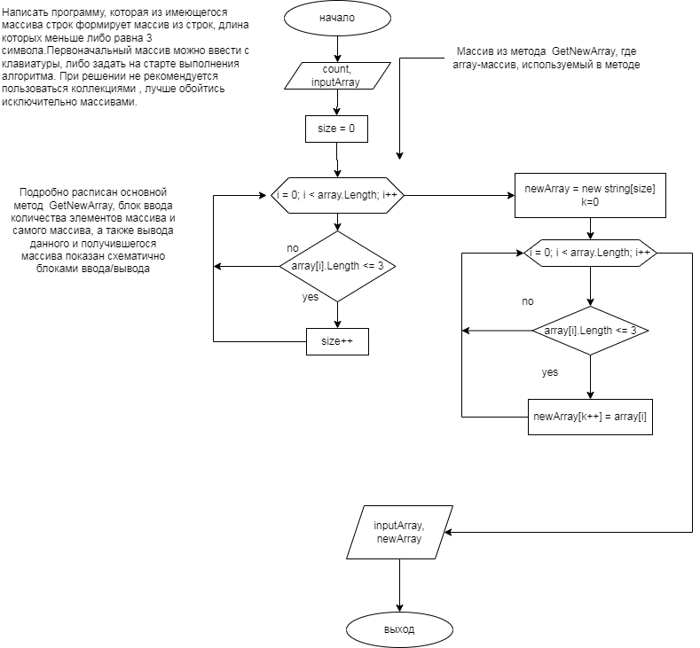

Это файл README.md - текстовое описание решения задачи

# Задача

***Написать программу, которая из имеющегося массива строк формирует массив из строк, длина которых меньше либо равна 3 символа.Первоначальный массив можно ввести с клавиатуры, либо задать на старте выполнения алгоритма. При решении не рекомендуется пользоваться коллекциями , лучше обойтись исключительно массивами.***

## Алгоритм решения

1. **Ввод данных.** Так как мы не знаем длину нашего массива строк, поэтому, в первую очередь, спрашиваем у пользователя ввести количество элементов массива. Если введено значение count, равное 0, то выдаем ошибку: "Введите корректное значение количества элементов массива!". Если значение count не равно нулю ,то Далее инициализируем массив длиной, равной введенному ранее количеству элементов. И просим пользователя ввести вручную каждый элемент массива строк. Наш массив строк заполнен.

2. **Алгоритм** создания нового массива выносим в метод GetNewArray(string[] array), который принимает наш введенный массив.Инициализирум новую переменную size, равную изначально 0, в ней будем хранить длину нашего будущего массива, который будет состоять из строк,длина которых меньше либо равна 3 символа. Для этого в цикле перебираем введенный массив, сравниваем длину каждого элемента массива, если она меньше или равна 3, то увеличиваем 
size. Далее объявляем новый строковый массив длиной size.
Заводим новый счетчик int k = 0 для нового массива. В новом цикле при условии, когда длина элемента массива меньше либо равна 3, присваиваем этот элемент в новый массив со счетчиком k, где счетчик после присваивания увеличивается. Метод GetNewArray(string[] array) возвращает новый массив с нужными нам элементами newArray.

3. **Вывод полученного массива** заложен в метод PrintArray. Соответственно, если у нас не будет ни одного элемента массива с длиной меньше или равной трем, то на предыдущем этапе мы получим массив длиной 0.Тогда в методе этот случай прописан условием. А в цикле организован вывод элементов массива.

## Блок-схема

Блок-схема решения задачи представлена на рисунке:

